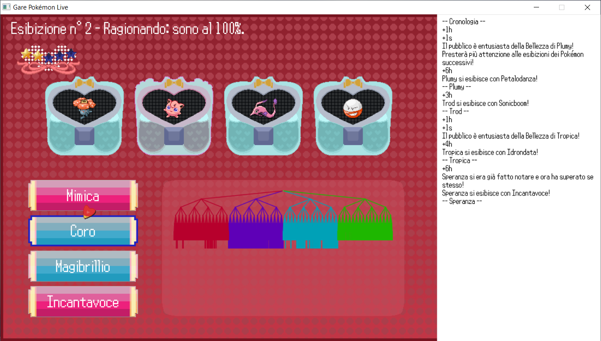

# MCTS Contest Thesis Project

My bachelor's thesis, **MCTS e videogiochi: un'applicazione per le Gare Pokémon
Live**, was an amusing and almost reckless adventure, but in the end the results
were very interesting and promising. Furthermore, I succeeded in combining
Pokémon with mathematics, and I'm quite proud of that.

This is the simulation software that I used in my thesis, which you can read
following the links below.

All reading material is written in Italian.

- [Thesis][tesi_tri]
- [Slides for the final defense][pres_tri]
- [Pokémon Contest Spectacular moves][mosse]

[tesi_tri]: docs/tesi.pdf
[pres_tri]: docs/diapositive.pdf
[mosse]: docs/MosseGarePokemonLive.pdf
